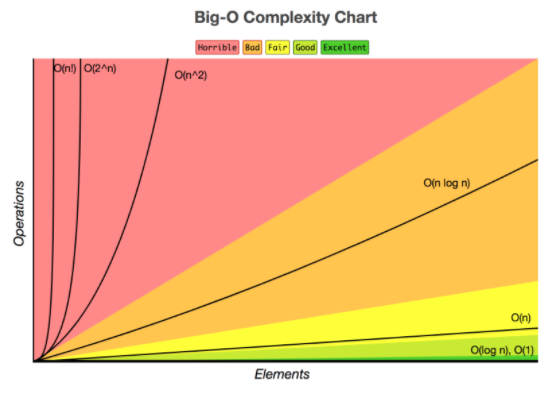

# 면접 대비 CS

## Algorithm

### BigO

- BigO의 개념
- BigO의 복잡성 차트 보기

### DFS와 BFS의 차이

- 깊이 우선 탐색(DFS, Depth-First Search)
  - DFS의 개념 : 루트 노드(혹은 다른 임의의 노드)에서 시작해서 다음 분기(branch)로 넘어가기 전에 해당 분기를 완벽하게 탐색하는 방법
    - 미로를 탐색할 때 한 방향으로 갈 수 있을 때까지 계속 가다가 더 이상 갈 수 없게 되면 다시 가장 가까운 갈림길로 돌아와서 이곳으로부터 다른 방향으로 다시 탐색을 진행하는 방법과 유사하다.
    - 즉, 넓게(wide) 탐색하기 전에 깊게(deep) 탐색하는 것이다.
    - 사용하는 경우 : 모든 노드를 방문하고자 하는 경우에 이 방법을 선택한다.
    - 깊이 우선 탐색(DFS)이 너비 우선 탐색(BFS)보다 좀 더 간단하다.
    - 단순 검색 속도 자체는 너비 우선 탐색(BFS)에 비해서 느리다.
  - DFS의 특징
    - 자기 자신을 호출하는 순환 알고리즘의 형태를 가지고 있다.
    - 전위 순회(Pre-Order Traversals)를 포함한 다른 형태의 트리 순회는 모두 DFS의 한 종류이다.
    - 이 알고리즘을 구현할 때 가장 큰 차이점은, 그래프 탐색의 경우 어떤 노드를 방문했는지 여부를 반드시 검사해야 한다는 것이다.
      - 이를 검사하지 않을 경우 무한루프에 빠질 수 있다.
  - DFS의 구현 방법 2가지
    1. 순환 호출 이용
    2. 명시적인 스택을 사용
       - 명시적인 스택을 사용하여 방문한 정점들을 스택에 저장하였다가 다시 꺼내어 작업한다.
- 너비 우선 탐색(BFS, Breadth-First Search)
  - BFS의 개념 : 루트 노드(혹은 다른 임의의 노드)에서 시작해서 인접한 노드를 먼저 탐색하는 방법
    - 시작 정점으로부터 가까운 정점을 먼저 방문하고 멀리 떨어져 있는 정점을 나중에 방문하는 순회 방법이다.
    - 즉, 깊게(deep) 탐색하기 전에 넓게(wide) 탐색하는 것이다.
    - 사용하는 경우 : 두 노드 사이의 최단 경로 혹은 임의의 경로를 찾고 싶을 때 이 방법을 선택한다. 
      - Ex) 지구상에 존재하는 모든 친구 관계를 그래프로 표현한 후 Ash와 Vanessa 사이에 존재하는 경로를 찾는 경우
      - 깊이 우선 탐색의 경우 - 모든 친구 관계를 다 살펴봐야 할지도 모른다.
      - 너비 우선 탐색의 경우 - Ash와 가까운 관계부터 탐색
    - 너비 우선 탐색(BFS)이 깊이 우선 탐색(DFS)보다 좀 더 복잡하다.
  - BFS의 특징
    - 직관적이지 않은 면이 있다.
      - BFS는 시작 노드에서 시작해서 거리에 따라 단계별로 탐색한다고 볼 수 있다.
    - BFS는 재귀적으로 동작하지 않는다.
    - 이 알고리즘을 구현할 때 가장 큰 차이점은, 그래프 탐색의 경우 어떤 노드를 방문했었는지 여부를 반드시 검사해야 한다는 것이다.
      - 이를 검사하지 않을 경우 무한루프에 빠질 위험이 있다.
    - BFS는 방문한 노드들을 차례로 저장한 후 꺼낼 수 있는 자료 구조인 큐(Queue)를 사용한다.
      - 즉, 선입선출(FIFO) 원칙으로 탐색
      - 일반적으로 큐를 이용해서 반복적 형태로 구현하는 것이 가장 잘 동작한다.
    - 'Prim', 'Dijkstra' 알고리즘과 유사하다.

---

### Fibonacci에서의 재귀 동적프로그래밍 반복의 세 가지 방식에 대한 시간복잡도와 공간복잡도

1. 재귀
2. 동적 프로그래밍
3. 반복

---

### 정렬 알고리즘의 종류와 개념

---

### MST란

- Spanning Tree란
  - 그래프 내의 모든 정점을 포함하는 트리, Spanning Tree = 신장 트리 = 스패닝 트리
  - Spanning Tree는 그래프의 최소 연결 부분 그래프이다.
    - 최소 연결 = 간선의 수가 가장 적다.
    - n개의 정점을 가지는 그래프의 최소 간선의 수는 (n-1)개이고, (n-1)개의 간선으로 연결되어 있으면 필연적으로 트리 형태가 되고 이것이 바로 Spanning Tree가 된다.
  - 즉, 그래프에서 일부 간선을 선택해서 만든 트리
- Spanning Tree의 사용 사례
  - 통신 네트워크의 구축
    - 예를 들어, 회사 내의 모든 전화기를 가장 적은 수의 케이블을 사용하여 연결하고자 하는 경우
    - n개의 위치를 연결하는 통신 네트워크를 최소의 링크(간선)를 이용하 구축하고자 하는 경우, 최소 링크의 수는 (n-1)개가 되고, 따라서 Spanning Tree가 가능해진다.
- MST(Minimum Spanning Tree, 최소 신장 트리)란
  - Spanning Tree 중에서 사용된 간선들의 가중치 합이 최소인 트리, MST = Minimum Spanning Tree = 최소 신장 트리
    - 각 간선의 가중치가 동일하지 않을 때 단순히 가장 적은 간선을 사용한다고 해서 최소 비용이 얻어지는 것은 아니다.
    - MST는 간선의 가중치를 고려하여 최소 비용의 Spanning Tree를 선택하는 것을 말한다.
    - 즉, 네트워크(가중치를 간선에 할당한 그래프)에 있는 모든 정점들을 가장 적은 수의 간선과 비용으로 연결하는 것이다.
- MST의 특징
  - i. 간선의 가중치의 합이 최소여야 한다.
  - ii. n개의 정점을 가지는 그래프에 대해 반드시 (n-1)개의 간선만을 사용해야 한다.
  - iii. 사이클이 포함되어서는 안된다.
- MST의 사용 사례
  - 통신망, 도로망, 유통망에서 길이, 구축 비용, 전송 시간 등을 최소로 구축하려는 경우
    - 도로 건설 : 도시들을 모두 연결하면서 도로의 길이가 최소가 되도록 하는 문제
    - 전기 회로 : 단자들을 모두 연결하면서 전선의 길이가 가장 최소가 되도록 하는 문제
    - 통신 : 전화선의 길이가 최소가 되도록 전화 케이블 망을 구성하는 문제
    - 배관 : 파이프를 모두 연결하면서 파이프의 총 길이가 최소가 되도록 연결하는 문제

---

### Kruskal MST 알고리즘

- Kruskal MST 알고리즘이란
  - 탐욕적인 방법(greedy method)을 이용하여 네트워크 (가중치를 간선에 할당한 그래프)의 모든 정점을 최소 비용으로 연결하는 최적 해답을 구하는 것
    - MST(최소 비용 신장 트리)가 1) 최소 비용의 간선으로 구성됨 2) 사이클을 포함하지 않음 의 조건에 근거하여 각 단계에서 사이클을 이루지 않는 최소 비용 간선을 선택한다.
    - 간선 선택을 기반으로 하는 알고리즘이다.
    - 이전 단계에서 만들어진 신장 트리와는 상관없이 무조건 최소 간선만을 선택하는 방법이다.
- 과정
  - i. 그래프의 간선들을 가중치의 오름차순으로 정렬한다.
  - ii. 정렬된 간선 리스트에서 순서대로 사이클을 형성하지 않는 간선을 선택한다.
    - 즉, 가장 낮은 가중치를 먼저 선택하다.
    - 사이클을 형성하는 간선을 제외한다.
  - iii. 해당 간선을 현재의 MST(최소 비용 신장 트리)의 집합에 추가한다.

---

### Prim MST 알고리즘

- Prim MST 알고리즘이란
  - 시작 정점에서부터 출발하여 신장트리 집합을 단계적으로 확장해나가는 방법
    - 정점 선택을 기반으로 하는 알고리즘이다.
    - 이전 단계에서 만들어진 신장 트리를 확장하는 방법이다.
- 과정
  - i. 시작 단계에서는 시작 정점만이 MST(최소 비용 신장 트리) 집합에 포함된다.
  - ii. 앞 단계에서 만들어진 MST 집합에 인접한 정점들 중에서 최소 간선으로 연결된 정점을 선책하여 트리를 확장한다.
    - 즉, 가장 낮은 가중치를 먼저 선택한다.
  - iii. 위의 과정을 트리가 (N-1)개의 간선을 가질 때까지 반복한다.